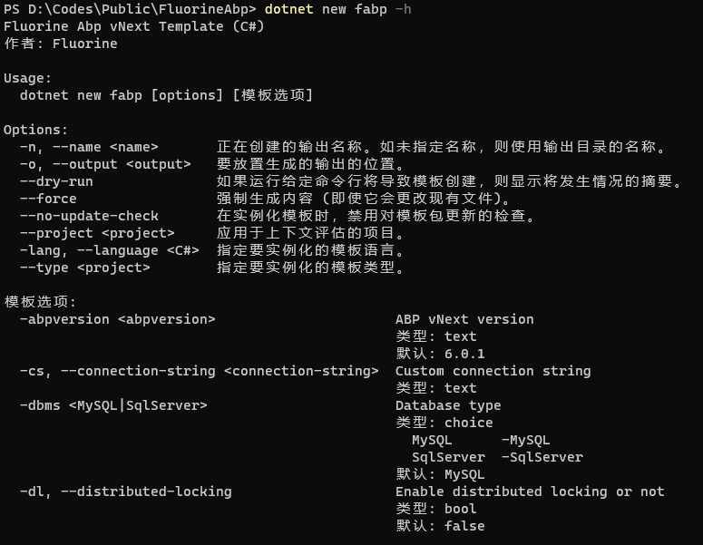

> install template

`dotnet new --install Fluorine.Abp.Template::1.0.0`

> usage

`dotnet new fabp -h`

> examples

- `dotnet new fabp`
- `dotnet new fabp -abpversion 6.0.1`
- `dotnet new fabp -abpversion 6.0.1 -dbms MySQL`
- `dotnet new fabp -abpversion 6.0.1 -dbms SqlServer --connection-string "Server=127.0.0.1;Database=TestMyAbp;Trusted_Connection=True;TrustServerCertificate=True"
`